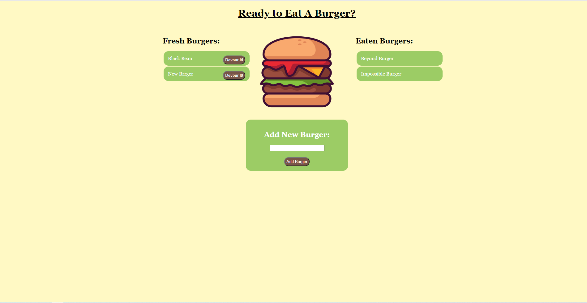

# Eat The Burger

## Description

This Express Handlebars web app is a fun little program that updates a database of user submitted burgers and when the "Devour It" button is pressed moves them over to the eaten column. This was built using MySQL for working with the database and Handlebars to dynamically upload the data from the server to the page. 

## Table of Contents

* [Screenshot](#Screenshot)

* [License](#license)

## Screenshot

## License

- MIT

- https://opensource.org/licenses/MIT

